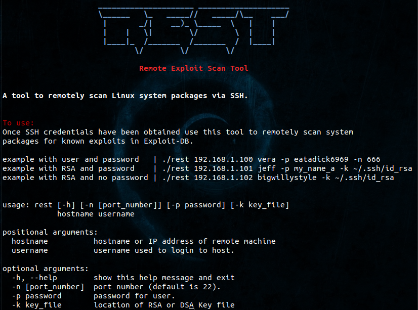

# rest
Remote Exploit Scan Tool <br /> 
A tool to remotely scan Linux system packages via SSH. <br />


## Requirements
Linux (tested on Kali), Python 3.6+, pip, and searchsploit. <br />
Update and upgrade repos before running. <br />
```
sudo apt update && apt upgrade
git clone https://github.com/plasticuproject/rest.git
cd rest && pip3 install -r requirements.txt
chmod +x rest
./rest --help
```
Currently only works against Debian based systems employing the dpkg package management system. <br />
There are plans to support other distros and package management systems in the future. <br />
Bug testing, additions, and rewrites are welcome, just submit an issue or pull request. <br />
Thanks to mikesZ81 for concept and inital logic <br />


## Usage


